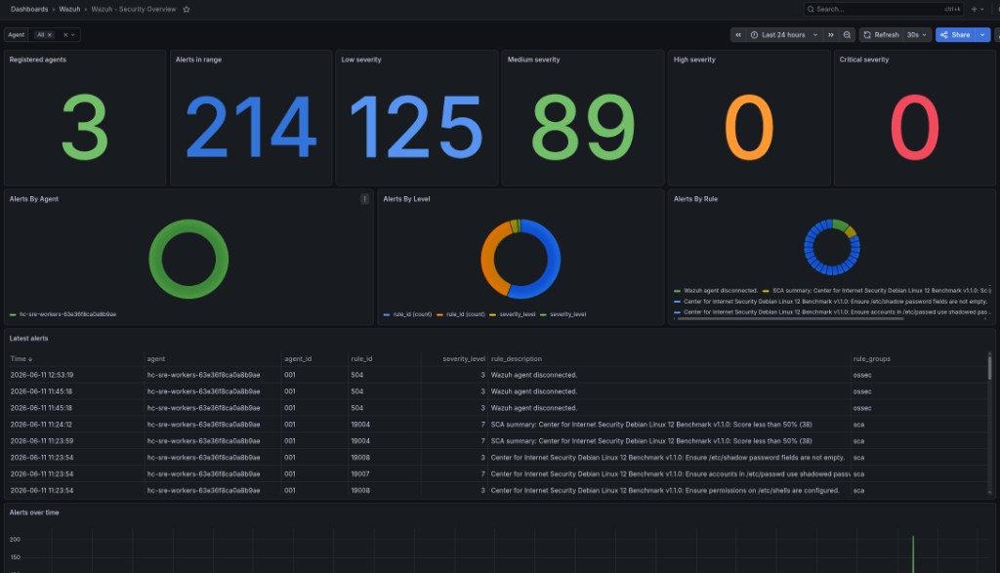

# Wazuh Datasource for Grafana

Open-source Grafana plugin that connects to Wazuh (manager API + indexer) so security data appears alongside your existing dashboards — without manual OpenSearch configuration.



Bundled dashboards cover alerts, vulnerabilities, FIM, SCA, and agent status. Install from [GitHub Releases](https://github.com/armanfeyzi/grafana-wazuh-data-source/releases) — see the [Installation Guide](docs/installation.md).

## Quick start

```bash
npm install
npm run build
go run github.com/magefile/mage@latest -v build:linux
make dev    # Grafana at http://localhost:3000
```

Add the **Wazuh** datasource in the UI with your manager and indexer URLs. See the [Installation Guide](docs/installation.md).

## Documentation

**Site:** [armanfeyzi.github.io/grafana-wazuh-data-source](https://armanfeyzi.github.io/grafana-wazuh-data-source/) *(GitHub Pages — enable in repo Settings → Pages → `/docs` on `main`)*

| Guide | Audience |
|-------|----------|
| [Installation](docs/installation.md) | Install plugin + configure datasource |
| [Development](docs/development.md) | Local plugin hacking |
| [Kubernetes](docs/kubernetes.md) | Production / in-cluster Wazuh |
| [RBAC guide](docs/rbac.md) | Minimum required API + indexer permissions |
| [Field mapping](docs/field-mapping.md) | Normalized field names ↔ Prometheus/Loki labels |
| [Optional Wazuh lab](deploy/wazuh-lab/README.md) | Local wazuh-docker stack |
| [Project brief](project-brief.md) | Goals and scope |
| [Status](docs/status.md) | What's done and what's next |
| [Roadmap](docs/project-roadmap.md) | Phases and architecture |
| [Contributing](CONTRIBUTING.md) | Dev setup, architecture, adding a data type |

## Requirements

- Node.js 22+, Go 1.22+
- Grafana 10.4+, Wazuh 4.7+
- Docker/Podman (local Grafana dev only)

## Bundled dashboards

Security Overview, Vulnerabilities, FIM, SCA, and Agent Status — import from the plugin or provision from `dist/dashboards/`. Require datasource **`uid: wazuh`** when using provisioning (see `provisioning/examples/`).

## Deploy paths

```text
Plugin dev     →  make dev              (deploy/dev/ — dashboards in Wazuh folder)
Optional lab   →  make lab-up           (deploy/wazuh-lab/)
Kubernetes     →  deploy/kubernetes/    (docs/kubernetes.md)
```

After `make dev`, open **Dashboards → Wazuh** for bundled dashboards. Datasource UID must be **`wazuh`** (set in Connections → Data sources → Wazuh → General).

## License

Apache 2.0 — see [LICENSE](LICENSE).
