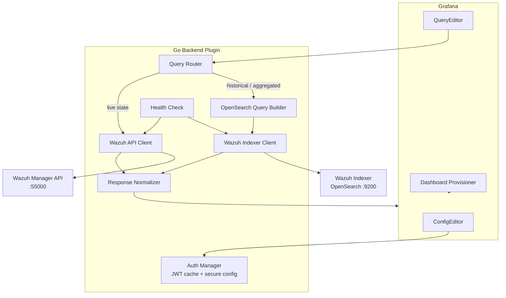

# Wazuh Grafana Datasource Plugin — Project Roadmap

> **Status:** Phases 0–5 complete; Phase 6 partial; Phase 7 next  
> **Last updated:** 2026-05-22  
> **Live progress:** [status.md](./status.md) · [milestones.md](./milestones.md)

Architecture and delivery plan for the [project brief](../project-brief.md). Task tracking lives in [milestones.md](./milestones.md).

---

## 1. Executive Summary

We will build an **open-source Grafana datasource plugin** that makes Wazuh security data queryable inside Grafana without manual OpenSearch configuration. The plugin abstracts Wazuh's dual data paths — **Wazuh Indexer (OpenSearch)** for high-volume historical data and **Wazuh REST API** for live state — behind a single datasource configuration and a Wazuh-aware query editor.

The repository is a **working Grafana backend plugin** with all v1 data types, bundled dashboards, and a clean multi-environment deploy layout (`deploy/dev`, `deploy/wazuh-lab`, `deploy/kubernetes`).

**Primary success metrics** (from the brief):

| Criterion | Target |
|-----------|--------|
| Time to first working datasource | < 5 minutes, zero OpenSearch knowledge |
| Pre-built dashboard value | Immediate, one-click import |
| Cross-datasource correlation | Agent/node/namespace variables link Wazuh ↔ Prometheus |
| Deployment model | Self-hosted Wazuh; credentials never reach the browser |
| Adoption signal | Engineers check security posture in Grafana routinely |

---

## 2. Stack Verification

### 2.1 Recommended Stack

| Layer | Technology | Rationale |
|-------|------------|-----------|
| **Plugin scaffold** | [`@grafana/create-plugin`](https://grafana.com/developers/plugin-tools/) | Official CLI; generates frontend + optional backend structure, Docker dev env, CI templates |
| **Frontend** | TypeScript, React, `@grafana/ui`, `@grafana/data` | Standard for Grafana plugins; ConfigEditor + QueryEditor components |
| **Backend** | Go + [`grafana-plugin-sdk-go`](https://grafana.com/developers/plugin-tools/key-concepts/backend-plugins/grafana-plugin-sdk-for-go) | **Required** — credentials and upstream calls must stay server-side; enables health checks and alerting hooks |
| **Build (backend)** | Mage (`mage -v build:linux`) | Grafana plugin convention for cross-compiling backend binaries |
| **Indexer client** | OpenSearch/Elasticsearch HTTP `_search` API | Wazuh Indexer is OpenSearch-compatible; no need for a heavy client library initially |
| **API client** | Go `net/http` + JWT auth | Wazuh API uses JWT via `POST /security/user/authenticate` |
| **Local dev** | Docker Compose (Grafana 10+) | Provided by create-plugin scaffold |
| **CI** | GitHub Actions | Lint, unit tests, backend build, optional plugin signing |
| **Packaging** | `plugin.json` + signed ZIP | Grafana plugin marketplace / manual install |

### 2.2 Stack Verification — Pass/Fail

| Requirement (from brief) | Stack fit | Notes |
|--------------------------|-----------|-------|
| Secure credential handling | ✅ Pass | Backend plugin stores secrets in Grafana's secure JSON; never sent to browser |
| Dual connection (Indexer + API) | ✅ Pass | Backend query router selects path per data type |
| Wazuh-aware query editor | ✅ Pass | Frontend sends structured query model; backend translates to OS DSL or API calls |
| Pre-built dashboards | ✅ Pass | JSON dashboard provisioning via plugin `dashboards/` directory or import endpoint |
| Mixed-datasource dashboards | ✅ Pass | Native Grafana capability; plugin must expose consistent field/label names |
| Self-hosted Wazuh | ✅ Pass | Configurable URLs, TLS skip-verify option, basic/JWT auth |
| No OpenSearch knowledge required | ✅ Pass | Index patterns and field mappings are hardcoded/versioned in the plugin |
| Extensibility for future tools (Trivy, Kyverno) | ⚠️ Partial | Out of scope for v1; architecture should use a **data-type registry** pattern so new sources can be added without rewriting the router |

### 2.3 Platform Targets

| Setting | Value |
|---------|-------|
| Minimum Wazuh version | 4.7+ (indexer-based vulnerability data; legacy vuln API dropped) |
| Minimum Grafana version | 10.4+ |
| Credentials | One username/password pair for Manager API and Indexer in v1 |
| Dashboards | Bundled under `dashboards/` in the plugin package |
| Plugin ID | `wazuh-datasource` |
| License | Apache 2.0 |

Separate API/indexer credentials and Grafana.com dashboard publishing are deferred to a later release if needed.

### 2.4 Explicit Non-Goals (v1)

- Wazuh administration (active response, rule editing, agent enrollment)
- Full SIEM feature parity with the Wazuh dashboard
- Wazuh Cloud SaaS as a first-class target (may work, but untested initially)
- Replacing the generic Grafana OpenSearch datasource for arbitrary indices

---

## 3. High-Level System Architecture

### 3.1 Component Diagram



### 3.2 Data-Path Routing (User-Transparent)

The query editor exposes **data types**, not backends. The backend router maps each type to the optimal path:

| Data Type | Primary Backend | Index / Endpoint | Query Pattern |
|-----------|----------------|------------------|---------------|
| Alerts (time series) | Indexer | `wazuh-alerts-*` | Date histogram + terms agg |
| Alerts (raw events) | Indexer | `wazuh-alerts-*` | Search + sort by `@timestamp` |
| Vulnerabilities | Indexer | `wazuh-states-vulnerabilities-*` | Terms agg on severity, agent |
| FIM events | Indexer | `wazuh-alerts-*` (rule groups) or `wazuh-states-fim-*` | Filter on syscheck/rule fields |
| SCA results (historical) | Indexer | Alerts with `rule.groups: sca` | Score aggregation over time |
| SCA results (current) | REST API | `GET /sca/{agent_id}` | Per-agent live score |
| Agent status | REST API | `GET /agents` | List + status filter |
| Agent list (for variables) | REST API | `GET /agents` | Label extraction |

> **Design note:** Wazuh 4.x moved vulnerability data to indexer state indices; the legacy `GET /vulnerability` API is deprecated since 4.7. The plugin should prefer indexer queries for vulnerabilities.

### 3.3 Query Model (Structured, Not Raw JSON)

The frontend sends a versioned JSON query object; the backend owns translation:

```json
{
  "dataType": "alerts",
  "format": "time_series",
  "aggregation": "count",
  "groupBy": "rule.level",
  "filters": {
    "agent.name": ["web-01", "web-02"],
    "rule.level": { "gte": 7 }
  },
  "limit": 10
}
```

This keeps the query editor approachable while allowing the backend to evolve OpenSearch DSL without UI changes.

### 3.4 Field Normalization for Correlation

To enable dashboard variables linking Wazuh panels to Prometheus/Loki, the response normalizer maps Wazuh fields to Grafana-friendly names:

| Wazuh Source Field | Normalized Label | Used For |
|--------------------|------------------|----------|
| `agent.name` | `agent` | Agent-scoped dashboards |
| `agent.id` | `agent_id` | API cross-reference |
| `agent.ip` | `host_ip` | Node correlation |
| `data.host` / `host.name` | `host` | Infrastructure correlation |
| `kubernetes.namespace` (if present) | `namespace` | K8s namespace rows |
| `rule.id` | `rule_id` | Top rules panel |
| `rule.level` | `severity_level` | Alert severity |
| `vulnerability.severity` | `severity` | Vuln breakdown |

### 3.5 Repository Structure (Target)

```
grafana-wazuh-data-source-plugin/
├── src/                          # Frontend (React/TS)
│   ├── module.ts                 # Plugin registration
│   ├── datasource.ts             # Frontend datasource class
│   ├── components/
│   │   ├── ConfigEditor.tsx      # URL, credentials, TLS, Save & Test
│   │   └── QueryEditor.tsx       # Data type, filters, aggregation
│   └── types.ts                  # Shared query/config types
├── pkg/
│   └── plugin/
│       ├── main.go               # Backend entrypoint
│       ├── datasource.go         # QueryData + CheckHealth handlers
│       ├── auth.go               # JWT acquisition + caching
│       ├── router.go             # Data type → backend routing
│       ├── opensearch/           # Indexer query builder + client
│       ├── wazuhapi/             # REST API client
│       └── normalize/            # Response → Grafana data frames
├── provisioning/examples/        # Datasource + dashboard templates (not auto-mounted)
├── deploy/
│   ├── dev/                      # Grafana-only local development
│   ├── kubernetes/               # K8s ConfigMap / Secret examples
│   └── wazuh-lab/                # Optional wazuh-docker lab
├── docs/
├── Makefile                      # dev, lab-up, lab-connect targets
└── src/plugin.json
```

### 3.6 Configuration Surface

Single datasource config with optional advanced overrides:

| Field | Required | Purpose |
|-------|----------|---------|
| Wazuh Manager URL | Yes | REST API base (e.g. `https://wazuh.example.com:55000`) |
| Wazuh Indexer URL | Yes | OpenSearch base (e.g. `https://indexer.example.com:9200`) |
| Username / Password | Yes | Stored in secure JSON; used for both paths (RBAC may differ — see risks) |
| Skip TLS Verify | No | Dev/self-signed cert environments |
| Index prefix override | No | For non-default index patterns (advanced) |
| API timeout | No | Default 30s |

---

## 4. Milestones & Task Breakdown

Each task includes **Definition of Done (DoD)** criteria. Milestones are sequential; some tasks within a phase can run in parallel (noted where applicable).

---

### Phase 0 — Project Setup & Dev Environment

**Goal:** Runnable plugin skeleton with CI and a documented local dev loop.

| ID | Task | DoD |
|----|------|-----|
| 0.1 | Scaffold plugin with `@grafana/create-plugin` (backend enabled) | Repo contains `src/`, `pkg/`, `plugin.json`, `docker-compose.yaml`; `npm run dev` starts Grafana with plugin loaded |
| 0.2 | Configure Go module + SDK version pin | `go.mod` resolves; `mage -v build:linux` produces backend binary |
| 0.3 | Set up GitHub Actions CI | CI runs on PR: frontend lint/typecheck, Go test, backend build |
| 0.4 | Document local dev prerequisites | README covers: Node 20+, Go 1.22+, Docker, `npm run dev`, connecting to a Wazuh lab |
| 0.5 | Define shared TypeScript/Go query types | `types.ts` and Go structs for config + query model are aligned and documented |

**Phase 0 exit criteria:** A developer can clone, run `npm run dev`, see the plugin in Grafana's datasource list, and CI is green on an empty implementation.

---

### Phase 1 — Core Infrastructure

**Goal:** Secure dual-connection backend with working Save & Test.

| ID | Task | DoD |
|----|------|-----|
| 1.1 | Implement ConfigEditor UI | Fields for Manager URL, Indexer URL, credentials, TLS options; values persist on save |
| 1.2 | Implement secure JSON handling | Passwords stored via `secureJsonData`; never returned to frontend after save |
| 1.3 | Wazuh API auth module | Backend obtains JWT from `/security/user/authenticate`; caches token with TTL; refreshes on 401 |
| 1.4 | Wazuh Indexer client | Backend performs authenticated `_cluster/health` or `_cat/indices` against indexer |
| 1.5 | CheckHealth handler | Save & Test returns green when both API and Indexer are reachable; actionable error messages on failure |
| 1.6 | Integration test harness | Docker Compose or mock servers for CI health-check tests (can use httptest mocks initially) |

**Phase 1 exit criteria:** User enters Wazuh URLs + credentials, clicks Save & Test, sees green confirmation. Credentials are not visible in browser network tab.

---

### Phase 2 — Query Engine MVP (Alerts + Agents)

**Goal:** End-to-end query path for the two highest-value data types.

| ID | Task | DoD |
|----|------|-----|
| 2.1 | Query router skeleton | `QueryData` dispatches by `dataType` field; unknown types return clear error |
| 2.2 | Alerts — time series query | Backend builds OS date_histogram query on `wazuh-alerts-*`; returns Grafana time series frame |
| 2.3 | Alerts — table/raw query | Returns latest N alerts with timestamp, rule, agent, level, description columns |
| 2.4 | Alerts — filter support | Filters for agent name, rule level range, rule group applied in OS query |
| 2.5 | Agent status query (API) | Backend calls `GET /agents`; returns table with name, status, OS, version, last keepalive |
| 2.6 | Response normalizer | All responses use consistent field names and Grafana `data.Frame` types |
| 2.7 | Backend unit tests | Query builder and normalizer covered with fixture JSON; ≥ 80% coverage on builder package |

**Phase 2 exit criteria:** A panel can show alert count over time and a separate panel can list agent connection status, both via the backend plugin.

---

### Phase 3 — Query Editor UI

**Goal:** Wazuh-aware editor that replaces raw OpenSearch JSON.

| ID | Task | DoD |
|----|------|-----|
| 3.1 | Data type selector | Dropdown: Alerts, Vulnerabilities, FIM, SCA, Agent Status (disabled types greyed until implemented) |
| 3.2 | Format selector | Options: Time series, Table, Stat (single value) — options vary by data type |
| 3.3 | Filter controls | Agent name (multi-select or text), rule level, severity, time range inherited from Grafana |
| 3.4 | Aggregation controls | Count over time, Top N by field, Latest events — controls shown contextually |
| 3.5 | Query validation | Inline errors for invalid combinations before run (e.g., Top N without group-by field) |
| 3.6 | Query persistence | Query model serializes into panel JSON; reloads correctly on dashboard save/load |

**Phase 3 exit criteria:** User builds a custom alert panel using only dropdowns/text fields — no hand-written queries.

---

### Phase 4 — Extended Data Types

**Goal:** Full data type coverage from the brief.

| ID | Task | DoD |
|----|------|-----|
| 4.1 | Vulnerabilities — indexer queries | Queries `wazuh-states-vulnerabilities-*`; severity breakdown + per-agent package table |
| 4.2 | FIM — event queries | Returns recent file changes with agent, path, user, action; Top N modified paths |
| 4.3 | SCA — current scores (API) | Per-agent compliance score table via `/sca/{agent_id}` |
| 4.4 | SCA — historical trends (indexer) | Score trend over time from alert indices |
| 4.5 | Index pattern version detection | Plugin handles `wazuh-alerts-4.x-*` vs legacy patterns; documented in config |
| 4.6 | Enable all data types in QueryEditor | All five data type options functional with appropriate filters |

**Phase 4 exit criteria:** Each data type in the brief returns correct data in both table and aggregated panel formats.

---

### Phase 5 — Pre-Built Dashboards

**Goal:** One-click import dashboards covering common Wazuh use cases.

| ID | Task | DoD |
|----|------|-----|
| 5.1 | Dashboard: Security Overview | Panels: alerts today (stat), severity over time, top rules, most active agents |
| 5.2 | Dashboard: Vulnerability Detection | Panels: severity breakdown, vulnerable packages per agent, newest CVEs |
| 5.3 | Dashboard: FIM | Panels: recent changes by agent, top modified paths, changes by user |
| 5.4 | Dashboard: SCA | Panels: compliance score per agent, failed checks, score trend |
| 5.5 | Dashboard: Agent Status | Panels: active/disconnected/never connected counts, OS distribution, version distribution |
| 5.6 | Dashboard provisioning | Dashboards shipped in `dashboards/`; UIDs prefixed to avoid collisions on import |
| 5.7 | Dashboard variables | Each dashboard includes `agent`, `severity`, and `$__interval` variables |

**Phase 5 exit criteria:** New user imports all five dashboards and sees populated panels within 5 minutes of adding the datasource (per success criterion #1 and #2).

---

### Phase 6 — Correlation & Multi-Datasource UX

**Goal:** Wazuh data links naturally to Prometheus/Loki on shared dashboards.

| ID | Task | DoD |
|----|------|-----|
| 6.1 | Template variable: agent list | Grafana variable queries Wazuh datasource for agent names; usable across panels |
| 6.2 | Template variable: namespace | If k8s metadata present in Wazuh data, expose namespace variable |
| 6.3 | Example mixed dashboard | Sample dashboard with Prometheus node CPU + Wazuh alerts filtered by same host/agent variable |
| 6.4 | Field naming audit | Document normalized field names and recommended Prometheus label mappings |
| 6.5 | Provisioning example | `provisioning/datasources/` example YAML for GitOps deployments |

**Phase 6 exit criteria:** A dashboard row can filter both a Prometheus panel and a Wazuh panel with a single `$agent` variable (success criterion #3).

---

### Phase 7 — Hardening, Documentation & Release

**Goal:** Production-ready open-source release.

| ID | Task | DoD |
|----|------|-----|
| 7.1 | Error handling pass | All upstream failures return user-friendly messages (auth, timeout, index missing, RBAC denied) |
| 7.2 | Performance testing | Alert time-series query over 7-day window completes in < 10s against a medium-sized deployment |
| 7.3 | Security review | No credentials in logs; TLS defaults documented; RBAC least-privilege guide written |
| 7.4 | User documentation | docs/ covers: install, configure, data types, dashboards, correlation, troubleshooting |
| 7.5 | Contributor documentation | CONTRIBUTING.md: dev setup, architecture overview, how to add a data type |
| 7.6 | Release v0.1.0 | Signed plugin ZIP; GitHub release with changelog; compatible Grafana versions declared in `plugin.json` |
| 7.7 | Marketplace submission (optional) | Plugin submitted to Grafana catalog or documented manual install path verified |

**Phase 7 exit criteria:** v0.1.0 released; a new user can follow docs-only path from zero to working dashboards.

---

## 5. Risk Assessment

### 5.1 High Priority

| Risk | Impact | Likelihood | Mitigation |
|------|--------|------------|------------|
| **Wazuh index schema changes across versions** | Queries break silently or return empty data | High | Pin tested Wazuh versions (4.x); version-detection in health check; fixture-based tests per version; document supported versions |
| **Dual RBAC models (API vs Indexer)** | Single credential set may lack permissions on one backend | High | Health check validates both paths independently; document required RBAC roles for each; optional separate credentials (v1.1) |
| **OpenSearch query performance on large alert volumes** | Slow panels, Grafana timeouts | High | Default time-range guardrails; `size: 0` agg queries for time series; index pattern filtering; configurable query timeout |
| **JWT token lifecycle / expiry** | API queries fail intermittently | Medium | Token cache with proactive refresh; retry-on-401 with re-auth |

### 5.2 Medium Priority

| Risk | Impact | Likelihood | Mitigation |
|------|--------|------------|------------|
| **FIM data split across indices** | Incomplete FIM coverage | Medium | Support both alert-based FIM events and `wazuh-states-fim-*` state indices; document which Wazuh modules populate which index |
| **SCA data duality (API vs indexer)** | Confusing or duplicate results | Medium | Query router enforces single path per format; UI labels clarify "current score" vs "historical trend" |
| **Kubernetes label availability** | Namespace correlation impossible on bare-metal agents | Medium | Graceful degradation — hide namespace variable when field absent; document agent k8s metadata requirements |
| **Grafana plugin SDK breaking changes** | Build failures on upgrade | Medium | Pin SDK version; CI matrix against 2 Grafana versions |
| **Self-signed TLS in lab environments** | Save & Test failures | Medium | `skipTlsVerify` option with prominent security warning in UI |

### 5.3 Lower Priority / Future

| Risk | Impact | Likelihood | Mitigation |
|------|--------|------------|------------|
| **Wazuh Cloud vs self-hosted differences** | Config assumptions break | Low | Defer Cloud support; architecture uses configurable URLs |
| **Grafana Alerting on Wazuh data** | Users expect alert rules | Medium | SDK supports alerting; evaluate in v0.2 after MVP stable |
| **Custom index prefix deployments** | Default patterns miss data | Low | Advanced config override for index prefix (Phase 1 config) |
| **Deprecation of Wazuh API endpoints** | Feature removal | Medium | Prefer indexer for vuln data; monitor Wazuh changelog |

---

## 6. Dependencies & Prerequisites

### 6.1 External Systems

- **Wazuh Manager** 4.7+ with REST API enabled (port 55000)
- **Wazuh Indexer** (OpenSearch) with standard Wazuh index templates applied
- **Grafana** 10.4+
- API user with RBAC: `agent:read`, `sca:read` at minimum
- Indexer user with read access to `wazuh-alerts-*`, `wazuh-states-vulnerabilities-*`, etc.
- Same credentials must be valid on both Manager API and Indexer (v1 constraint)

### 6.2 Development Lab

For integration testing, the team will need access to at least one of:

- A Wazuh OVA / Docker lab with sample agents generating alerts
- A dedicated test cluster with Wazuh deployed via Helm
- Recorded OpenSearch response fixtures for CI (fallback when live lab unavailable)

---

## References

- [Grafana Plugin Tools — Backend datasource tutorial](https://grafana.com/developers/plugin-tools/tutorials/build-a-data-source-backend-plugin)
- [Grafana Plugin SDK for Go](https://grafana.com/developers/plugin-tools/key-concepts/backend-plugins/grafana-plugin-sdk-for-go)
- [Wazuh Indexer indices](https://documentation.wazuh.com/current/user-manual/wazuh-indexer/wazuh-indexer-indices.html)
- [Wazuh Server API — Getting started](https://documentation.wazuh.com/current/user-manual/api/getting-started.html)
- [Wazuh API RBAC Reference](https://documentation.wazuh.com/current/user-manual/api/rbac/reference.html)
